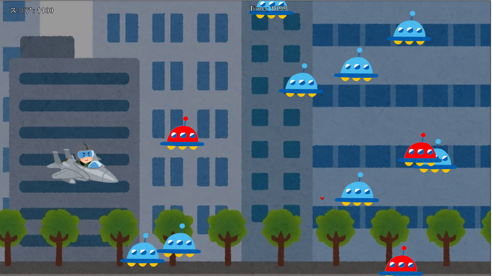

# team4

**Space Shooter Nakamura (SSN)**
オンラインマニュアル  
ストーリー  
宇宙人が攻めてきたので地球を防衛しなければならなくなってしまった。  
さあ行くのだ選ばれし者よ！  
- 操作方法  
  - 移動方法
    - W,↑（画面上方向に移動）
    - S,↓（画面下方向に移動）
    - A,←（画面左方向に移動）
    - D,→（画面右方向に移動）
  - 弾の発射
    - SpaceKey  

- クリア条件
  - タイムアップ

- GameOver条件
  - enemyに衝突

Start画面  

Stage1

Stage2

フリー音楽  
bgm　魔王魂様  
[https://maou.audio/bgm_cyber06/](https://maou.audio/bgm_cyber06/)  
衝突音 魔王魂様  
[https://maou.audio/se_battle18/](https://maou.audio/se_battle18/)

